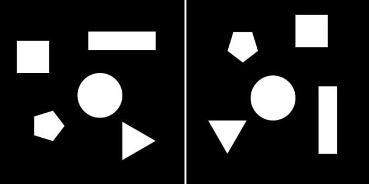
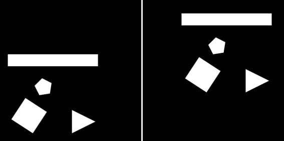

# Object Configurations Detection

## What This is
An implementation of an object configuration detection technique, that uses a graph matching approach based on 1D information.

The method uses a certain type of graphs to represent all the different spatial relations between objects in the scene.

After the graphs are set, the method can detect the configuration of the objects even when a transformation have been made,  like for example a translation or a rotation.

## Results
### Rotation
Input Images:

Output :

- The horizontal axe represents the angle of rotation
- The vertival axe represents the similarity

### Translation
Input Images:

Output :

- The horizontal axe represents the angle of rotation
- The vertival axe represents the similarity

## Prerequisites

To be able to work on this project you'll have to install <a href="https://www.python.org/downloads/windows/">python</a> & <a href="https://pypi.org/project/pip/">pip</a> on your machine

## Librairies
  * <a href="https://pillow.readthedocs.io/en/stable/installation.html">Pillow</a> : PIL is the Python Imaging Library,it can be installed using pip  `python -m pip install Pillow`
  * <a href="https://numpy.org/">numpy</a> : NumPy is the fundamental package for scientific computing with Python `python -m pip install numpy`
  * <a href="https://shapely.readthedocs.io/en/latest/">shapely</a> : Shapely is a Python package for manipulation and analysis of planar geometric objects.  `python -m pip install shapely`
  * <a>matplotlib</a>

## Reference

1. [L. Wendling 97] L. Wendling, J. Desachy, Isomorphism between Strong Fuzzy Relational
Graphs Based on k-Formulae, 1997 
2. [Mataskis et Wendling, 1999] P. Matsakis, L. Wendling, A new way to represent the relative position between areal objects, IEEE transactions on pattern analysis and machine, intelligence, VOL. 21, NO. 7, July 1999